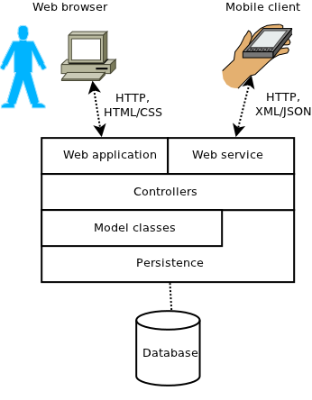

Web Applications
================

A *web application* is an application whose user interface is a web browser.

There are two basic approaches to developing web applications.

The "traditional" approach is that the web application runs entirely on the server, and dynamically generates HTML to be displayed in the client web browser. The user interacts with the application by submitting form data, which is sent to the web server as an HTTP POST request. The server handles the request by decoding the form parameters, deciding how to handle the request, and then generating another HTML document as a response.

The "modern" approach is that the web application runs both within the client web browser (as Javascript) and also on the server. The Javascript code can call code on the server using AJAX, which is a means of asynchronous communication with the server. (We will NOT be investigating Javascript and AJAX in this course, as you are likely already feeling overwhelmed with the additional languages and technologies to learn for this course.  :-)

Today we will discuss the "traditional" approach.

Java Web Applications
=====================

Java defines an API called J2EE, part of which specifies standard interfaces for developing web applications.

A Java web application consists of *servlets*, which allow the application to handle HTTP requests.

We could implement a traditional web application by having our servlets generate HTML directly. For example:

~~~ java

    package edu.ycp.cs320.lab11.servlet;

    import java.io.IOException;

    import javax.servlet.ServletException;
    import javax.servlet.http.HttpServlet;
    import javax.servlet.http.HttpServletRequest;
    import javax.servlet.http.HttpServletResponse;

    public class IndexServlet extends HttpServlet {
      private static final long serialVersionUID = 1L;

      @Override
      protected void doGet(HttpServletRequest req, HttpServletResponse resp)
          throws ServletException, IOException {

        resp.setContentType("text/html");
        resp.getWriter().print(
            "<html>" +
            "  <head>" +
            "    <title>Index page</title>" +
            "  </head>" +
            "  <body>" +
            "    This is the index page" +
            "  </body>" +
            "</html>");
      }
    }
	
~~~

Generating HTML embedded in Java string constants is both tedious and error-prone. Fortunately, J2EE gives us a better way to generate HTML, called Java Server Pages (JSPs).

Java Server Pages (JSPs)
------------------------

The idea behind JSPs is very simple: rather than embedding HTML in Java code, embed the Java code in HTML. The idea is that when generating an HTML page, most of the page is static HTML, but some of the page is generated dynamically. So, the HTML text in a JSP is simply sent verbatim to the client web browser. Through the use of the JSP *expression language* and JSP *tag libraries*, dynamic Java code can also be used to generate portions of the HTML document.

Model-View-Controller using servlets and JSPs
---------------------------------------------

Before we dive into JSPs, let's first consider how we want to *design* a web application. As with all user interfaces, we want to keep the model classes separate from the user interface classes. In a traditional GUI, we can use the model-view-controller (MVC) design pattern to do this. There is an analogue of MVC for web applications called (not very creatively) MVC2.

Here is the basic idea of how a request is handled in MVC2:

1.  The request parameters and/or form data is decoded and translated into one or more model objects which form the request. These request objects are then sent to a controller.
2.  The controller processes the request and produces one or more model objects as the result of the request.
3.  A view renders the request and result model objects as HTML that is sent back to the client.

The nice feature of MVC2 is that the application logic is implemented entirely in the controller, and the controllers depend only on model classes. This means that you can write unit tests for the controllers and execute them completely independently of the web application.

In a Java web application, the JSPs are ideal for implementing views: they make it easy to render HTML and include dynamic content (from the result model objects) where necessary.

An example MVC2 application using servlets and JSPs
---------------------------------------------------

Here is a web application that uses MVC2 to allow the user to add two numbers and see the result.

The model classes are very simple: they will simply be instances of **java.lang.Double** representing the numbers to be added (the request objects) and the result (the result object).

The controller will take the two request objects (the values to be added), add them, and produce a double result object which is the sum of the values of the request objects.

The view is a JSP which:

-   displays a form allowing the user to enter two numbers, along with a submit button
-   generates an HTTP POST request when the submit button is pressed
-   displays the result of the computation (if a result was computed by the controller)

Here is the code. First, the view JSP:

~~~ html

    <!DOCTYPE html>
    <%@ taglib uri="http://java.sun.com/jsp/jstl/core" prefix="c" %>
    <%@ taglib uri="http://java.sun.com/jsp/jstl/functions" prefix="fn" %>

    <html>
      <head>
        <title>Add Numbers</title>
        
      </head>

      <body>
        <c:if test="${! empty errorMessage}">
          
${errorMessage}

        </c:if>

        <form action="${pageContext.servletContext.contextPath}/addNumbers" method="post">
          <table>
            <tr>
              <td class="label">First number:</td>
              <td><input type="text" name="first" size="12" value="${first}" /></td>
            </tr>
            <tr>
              <td class="label">Second number:</td>
              <td><input type="text" name="second" size="12" value="${second}" /></td>
            </tr>
            <tr>
              <td class="label">Result:</td>
              <td>${result}</td>
            </tr>
          </table>
          <input type="Submit" name="submit" value="Add Numbers!">
        </form>
      </body>
    </html>
	
~~~

Mostly, the view is just HTML that creates a table of the two numbers to be entered. However, there are a couple of JSP-specific details to notice:

-   The directive **&lt;%@ taglib uri="<http://java.sun.com/jsp/jstl/core>" prefix="c" %&gt;** specifies that we want to use the JSTL core tag library. This allows us to use special tags for things like conditionals and loops. You will notice that we use the **&lt;c:if&gt;** tag to conditionally display an error message if the servlet has specified one.
-   The syntax **${** *...* **}** specifies a JSTL expression. JSTL expressions can be used to include dynamic content into the HTML document. The JSP above uses this syntax to substitute the values for the first and second input number, the result, and (if there is one) an error message.

Next, here is the servlet code which handles the requests:

~~~ java

    package edu.ycp.cs320.lab11.servlet;

    import java.io.IOException;

    import javax.servlet.ServletException;
    import javax.servlet.http.HttpServlet;
    import javax.servlet.http.HttpServletRequest;
    import javax.servlet.http.HttpServletResponse;

    import edu.ycp.cs320.lab11.controller.AddNumbersController;

    public class AddNumbersServlet extends HttpServlet {
      private static final long serialVersionUID = 1L;

      @Override
      protected void doGet(HttpServletRequest req, HttpServletResponse resp)
          throws ServletException, IOException {
        req.getRequestDispatcher("/_view/addNumbers.jsp").forward(req, resp);
      }

      @Override
      protected void doPost(HttpServletRequest req, HttpServletResponse resp)
          throws ServletException, IOException {

        // Decode form parameters and dispatch to controller
        String errorMessage = null;
        Double result = null;
        try {
          Double first = getDoubleFromParameter(req.getParameter("first"));
          Double second = getDoubleFromParameter(req.getParameter("second"));

          if (first == null || second == null) {
            errorMessage = "Please specify two numbers";
          } else {
            AddNumbersController controller = new AddNumbersController();
            result = controller.add(first, second);
          }
        } catch (NumberFormatException e) {
          errorMessage = "Invalid double";
        }

        // Add parameters as request attributes
        req.setAttribute("first", req.getParameter("first"));
        req.setAttribute("second", req.getParameter("second"));

        // Add result objects as request attributes
        req.setAttribute("errorMessage", errorMessage);
        req.setAttribute("result", result);

        // Forward to view to render the result HTML document
        req.getRequestDispatcher("/_view/addNumbers.jsp").forward(req, resp);
      }

      private Double getDoubleFromParameter(String s) {
        if (s == null || s.equals("")) {
          return null;
        } else {
          return Double.parseDouble(s);
        }
      }
    }
	
~~~

Most of the code is just parsing request parameters (the input numbers), setting request attributes (the data to be displayed by the view), and forwarding the request to the view JSP. However, the most important part is where the request is dispatched to the controller:

~~~ java

    AddNumbersController controller = new AddNumbersController();
    result = controller.add(first, second);
	
~~~

Because only model objects are involved, it would be easy to test the behavior of the controller using a JUnit test.

Finally, the controller:

~~~ java

    package edu.ycp.cs320.lab11.controller;

    public class AddNumbersController {
      public Double add(Double first, Double second) {
        return first + second;
      }
    }

~~~

Although this controller is trivial, in general a controller can be used to implement arbitrary application logic.

A good test that you have abstracted the controller well is that it is relatively easy to write JUnit tests:

~~~ java
    package edu.ycp.cs320.lab11.controller;

    import static org.junit.Assert.*;

    import org.junit.Before;
    import org.junit.Test;

    public class AddNumbersControllerTest {
      private AddNumbersController controller;

      @Before
      public void setUp() {
        controller = new AddNumbersController();
      }

      @Test
      public void testAddNumbers() {
        assertEquals((Double) 7.0, controller.add(3.0, 4.0));
      }
    }
	
~~~

Web Applications vs. Web Services
=================================

It is worth considering the distinction between web applications and web services.

-   A (RESTful) web service provides access to resources to *programs*, which communicate with the web service via HTTP requests (GET, PUT, POST, DELETE), returning the resource data in an easily-parsed format such as XML or JSON
-   A web application provides access to resources to *human beings* who communicate with the web application using a web browser, accepting HTTP GET and POST requests and returning the resource data in a format intended to be displayed visually (HTML, CSS, images.)

Web services and web applications are thus closely related to each other, but provide access to resources for different kinds of clients.

There is no reason why you can't implement a system which is *both* a web application and a web service. One approach: write your controllers and model classes so that they can be used by web application servlets/views and also by web service servlets:

> 
