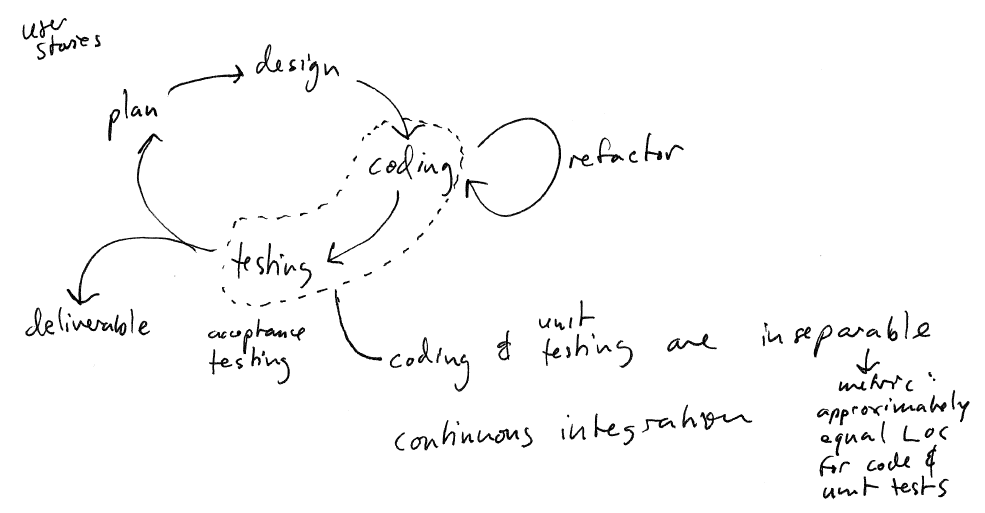

Iterative Development process
===================
As we've seen, waterfall can be easy to understand, and might sound attractive in theory because it ostensibly provides a high level of determinism in relation to project scheduling, required resources, and overall cost and development time.  In reality, however, the waterfall model is both impractical and too inflexible since there is no opportunity for feedback in the process. For example, we may discover new requirements during the Analysis phase, we may (and most likely will) discover more about the problem during the Design phase, etc.   And those discoveries will cause an iterative jump further back in the process.  Another major weakness of the waterfall model is that estimation is very complex: it's extremely difficult to predict how long we will need to complete each stage. It is also risky to assume that the entire system will "come together" at the end of the Implementation phase.

The overall goal in an iterative process is to make sure that the software is always in a consistent, stable state. At the end of each iteration, we should have a correctly working system that achieves some subset of the requirements.

Keeping the iterations short makes estimation and planning easier: we can get a pretty good idea of the rate of progress by seeing (on average) what % of the requirements we can finish at the end of each increment

The risk of trying to "put together" the entire system at the end is mitigated because the software is in a high-quality, "ready to deploy" state at all times.

Another important characteristic of a process is the level of ceremony. A **high-ceremony** process is one in which each development activity is done in a very specific way, and where the artifacts (documentation) created at each step (use cases, functional specifications, analysis and design models, etc.) may be highly detailed. A high-ceremony process may be necessary if the system being developed is safety-critical (medical device, weapons, spacecraft, avionics, etc.)

For many projects, a lower-ceremony process probably makes more sense.

Agile Processes
---------------

Agile is a form of iterative process - a series of short iterations (2-4 weeks), each of which is a "mini-waterfall".  Agile is a good general choice for non-safety-critical projects because it's low-ceremony and it emphasizes:

-   incremental development
-   direct and continuous interaction with customers
-   adapting to changing requirements by keeping the software flexible

Here is a sketch of what working within an agile process might look like.

> 

The customer is in constant contact with the development team, and is continually

-   explaining requirements (including changes and/or additions to requirements)
-   prioritizing requirements

At the beginning of each increment (let's say we will have two week increments), the customer chooses a set of requirements to be addressed in that increment, in order from most important to least important. The requirements are recorded as use cases.

The developers take the use cases, and use them to update the analysis and design models. This step is necessary because the existing design may not have anticipated the requirement being addressed by the use case, and needs to be extended to address the requirement. If the design model changes, the code is refactored to conform to the new design. Refactoring means changing the internal structure of code without changing WHAT the code does. In other words, after refactoring a program, the functionality of the program is exactly the same.

Examples of refactoring:

-   Moving a method from one class to another
-   Moving a field from one class to another
-   Splitting a single class into two classes
-   Splitting a single class into a class hierarchy (superclass and subclasses)

As developers refactor the code, they run all of the **automated unit tests** to make sure that the refactoring does not introduce any new bugs. Unit tests are low-level (fine-grained) tests that check whether particular classes/methods work correctly. The refactoring is complete when

-   the code matches the updated design
-   all of the pre-existing unit tests pass

Once refactoring is complete, the developers modify the code to add the new features (addressing the requirements selected by the customer). As they work, the developers also develop the associated unit tests to ensure the new classes and methods they are adding work correctly, and continue to run the old unit tests to make sure that no regressions have been introduced. A regression is a bug in which a change to the code causes a feature that previously worked to no longer work correctly.

At the end of the increment, the developers have implemented some number of new requirements.

If all of the customer's chosen requirements for the week have been addressed, great. Everyone's happy.

If some of the customer's chosen requrements have not been addressed, then the schedule has slipped. This is not necessarily bad; some aspect of a requirement may have been more complicated than anticipated. The customer and the development team adjust their planning appropriately. Occasional schedule slips may be tolerated. Frequent schedule slips mean that the developers are overestimating their rate of progress, and need to avoid over-committing in future increments.

There are a lot of good things about agile processes:

-   The rate of progress is always apparent - no big surprises.
-   Changing requirements are handled easily.
-   The customer is always "in the loop" and decides what work will be done. Developers don't spend time implementing unnecessary features. The most important features are the ones implemented first.
-   The system remains in a "ready to deploy" state at all times. (It might not implement all required features, but the features that are implemented work correctly.)

