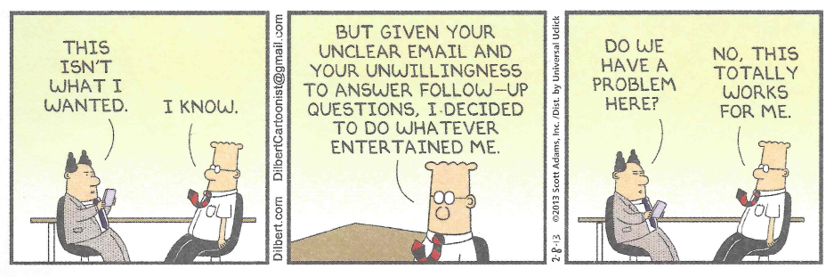

Requirements
============

Requirements are what the software must do.

Specifically: a requirement is a singular need which must be satisfied for the system to work correctly, e.g., an ATM must allow a customer to withdraw money from his/her account.

Issues:

-   gathering requirements: requires interacting with the customer

    -   customers aren't always that great at telling you what they want
	-	customers aren't always that great at recognizing what they NEED
    -   sometimes if you build exactly what they want(ed), they'll realize they want something different
	-	sometimes only after you build exactly what they asked for, will they realize what else it is they want
	
> 	

-   documenting requirements, AKA capturing requirements: **how do we do this?**
		
	-   making sure requirements are satisfied
    -   need to make sure that requirements have been addressed: **how do we do that - guarantee that every requirement has been met?**
    -   in a large system, with many requirements, this requires a great deal of attention to detail
	
So, let's have some "fun", and try to capture some requirements from a customer.

**I'll be the voice of the customer (VOC) and tell you what I (think) I want, and it's your job to figure out what it is that I will really want/need.**

Use cases
=========

Use cases are a way of describing how the system will satisfy its requirements.

A use case shows a scenario where one or more actors use the system.

Properties of a use case:

-   The use case has a **name** describing what the **scenario** accomplishes, e.g., "play a game of TicTacToe".  That is the **goal** of the scenario.
-   The **actors** are agents **external** to the system. They might be human users. Or, they could be other software systems.
-   An actor must be an **initiator** of the use case. In other words, the **scenario** described by the use case must be a response to an actor requesting that the system do something to achieve the initiator's goal.
-   The use case has a well-defined beginning and end. The end of the use case is the achievement of a **goal** (normal/expected outcome), or possibly an error (alternate path).

Note that although the use case will generally specify a sequence of steps, these steps must focus on WHAT the actor or actors experience, and NOT how the system achieves the functionality. So, the use case must not mention objects, methods, code, etc. The use case should also not describe the user interface: that is a separate activity.

There may be multiple paths through a use case. For example: if an error occurs, or if there is "optional" behavior seen in some cases, etc.

There are different ways of writing a use case. For some use cases, a single sentence might suffice. For more fully-specified use cases, listing a series of numbered steps is a good approach. As with any documentation, diagram, model, etc., the purpose is to specify an aspect of the system in enough detail to be useful, but not too much detail. Excessive detail is a waste of time.

So what does a use case look like?  Here's the example from "UML Distilled", including alternate paths, called extensions:

**Buy a Product from an Online Store**

MSS - Main Success Scenario:

	1. Customer **browses catalog and selects items to buy**

	2. Customer goes to check out

	3. Customer fills in shipping information (address, shipping info)

	4. System provides full pricing info, including shipping

	5. Customer fills in credit card info

	6. System authorizes purchase

	7. System confirms sale immediately

	8. System sends confirming email to customer

Extensions (alternate paths):

	3a: Customer is a regular customer

		.1: System provides current shipping, pricing, and billing information
		
		.2: Customer may accept or override those defaults, returns to MSS at step 6
		
	
	6a: System fails to authorize credit purchase

		.1: Customer may re-enter credit card info (returns to MSS at step 5)
		
		.2: Customer may cancel purchase
	

**Let's work an example: Uber (Ride Sharing App):**

-	Who are the possible actors?

<!-- commenting out the answers

-   Customer
-   Uber App on smartphone
-   Uber system (this is software, but it is external to the Customer and the App, so it is considered an actor)
-   Uber Driver
-   Credit Card company (authorizes payments)

--->

-	What are some of the requirements?

<!-- commenting out the answers

-   customers can set up accounts (username, password, credit card info)
-   drivers can enroll: set up account (username, password, vehicle, bank info)
-   customers credit card gets charged (must be valid)
-   driver receives payment via direct deposit, or Paypal, etc...
-   the system is secure (only authorized users can use)
-   rating system (customers and drivers can post)
-   etc.

--->

-	 What are some scenarios in which Uber is used?

<!-- commenting out the answers

-   customer requests a ride
-   drivers post availability
-   driver picks up additional passengers - reduces fare
-   customer schedules ride in advance
-   etc.

--->

-	Now let's pick a scenario and construct a use case for that scenario.

-	What requirement or requirements did this use case address?
