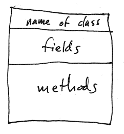
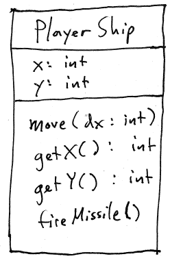
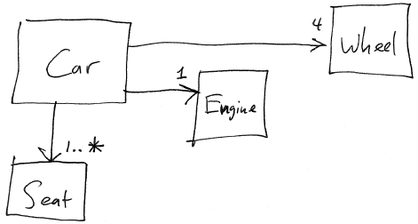
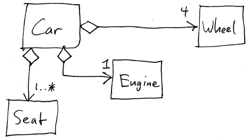
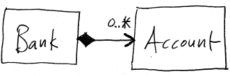
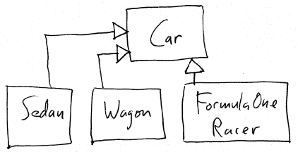

UML Class Diagrams
==================

UML class diagrams show the important characteristics of several classes, and the relationships between classes.

Classes
-------

A class is a rectangle. The name of the class is shown; optionally, fields and methods may be shown.

> 

Here is an example: the PlayerShip class (from a video game):

> 

There are two fields, **x** and **y**, both with type **int**.

There are four methods: **move**, **getX**, **getY**, and **fireMissile**. Method parameters (e.g., the **dx** parameter to the move method) and return types (e.g., the **int** return type for the **getX** and **getY**) may be shown.

As a contrast, here is what the **PlayerShip** class might look like in Java:

    public class PlayerShip {
        private int x;
        private int y;

        public PlayerShip(int initX, int initY) {
            ...
        }

        public void move(int dx) {
            ...
        }

        public int getX() {
            ...
        }

        public int getY() {
            ...
        }

        public void fireMissile() {
            ...
        }
    }

Notice that even though we've omitted the method code, the class diagram does a much better job of summarizing the essential characteristics of the class.

What is the point of a UML class diagram? It gives us the ability to talk about a program (a program being a collection of classes) at a high level: talking about the DESIGN rather than the IMPLEMENTATION. Because the purpose is to foster a high level discussion, many details about classes are ommitted from UML class diagrams.

Relationships between classes
=============================

An object-oriented program is a collection of objects which interact with each other. Since objects are instances of classes, deciding how different classes relate to each other is a fundamental part of designing an object-oriented program.

Associations, Aggregation, and Composition
------------------------------------------

A common relationship between classes is when one class is used by or part of another class.

Example:

> 

This class diagram shows that a Car object has 4 wheels, 1 Engine, and at least 1 seat. The arrows show that there is an Association between Car and Wheel, Car and Engine, and Car and Seat. The arrow head on the association indicates that the association is one-way: a Car "knows about" its Wheels, but a Wheel object does not know what Car it is part of.

A stronger kind of association is an Aggregation or Composition. These indicate a "whole to parts" relationship between the classes involved. Since a Car is made up of its parts, we are justified in making the associations into aggregations:

> 

The open diamond symbol connected to the "owner" indicates Aggregation.

A Composition relationship indicates that the "owned" object ceases to exist when the "owner" object ceases to exist. Since the Wheels, Engine, and Seats of a Car could exist after the Car is destroyed, we probably don't want to make these associations into Compositions.

Here is a possible example of a Composition relationship:

> 

If a Bank ceases to exist, then any Accounts existing at the Bank also cease to exist. Composition is shown by a filled diamond symbol connected to the "owner".

Inheritance
-----------

Inheritance is an IS-A relationship between classes. For example:

> 

In this example, Sedan, Wagon, and FormulaOneRacer are all kinds of Cars.

Inheritance is shown by an outlined triangle arrowhead symbol attached to the superclass.

Inheritance is useful when the are important common characteristics between classes, but there are important behavioral differences between the classes. The superclass embodies the common characteristics. The subclasses embody the behavioral differences between different kinds of objects.

Question: what are some behavioral differences between Sedans, Wagons, and FomulaOneRacers?

Designing Classes
=================

How do we know what classes we need? Formally, we find out by gathering requirements and performing an analysis of the problem domain.

Textual analysis: brainstorm words and phrases associated with the problem. The noun phrases are candidates for classes or fields, and the verb phrases are candidates to become methods (or possibly classes).

Exercise: TicTacToe game. The requirements are:

-   implement game logic
-   show the progress of the game in a GUI window
-   support any combination of human and AI (computer) players

