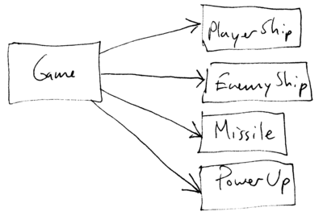
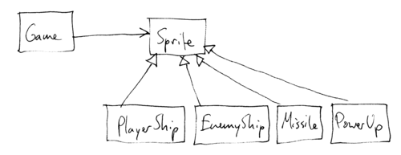
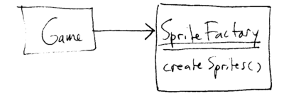

OO Design
=========

Basic idea: take our analysis model and turn it into a detailed blueprint for our implementation, the *design model*.

Goals for the design model:

> 1. Design a system that will solve the problem (with enough detail that the implementation should flow easily from the design).
>
> 2. Design a system that is easy to change.

Goal \#1 should be fairly obvious - there's no point in building incorrect software.

> **True, but what are some other reasons to invest time in "designing" the system?**

Goal \#2 has several important motivations:

> We know the requirements will change as the system evolves.
>
> We know that we will learn more about the problem and revisit earlier decisions.
>
> Designs that accommodate change tend to be easy to understand - which is very important when we're dealing with a complex system.

As always in software development, there are an infinite number of ways we could design a system to solve any particular problem.

> **So, what do we need to do in order to design a system that best achieves our goals?  And how should we interpret "best"?**

Having a good analysis model generally gives us a very good place to start in constructing a design model. So, if we simply **elaborate the analysis model** (adding methods, method parameters and return types, fields, etc.) we will most likely get a reasonably good design. However, as we build the design model, we will have many opportunities to *improve* the design.

> **So, the question becomes, "what makes a good design?"**

There is one ultimate principle that describes good design, in software as well as almost any other kind of system:

> The simplest solution that solves the problem is generally the best one.

> **Can you think of situations when the above statement might not apply?**

Simplicity has many benefits:

> less code to write, debug, maintain
>
> the system is easier to understand
>
> the system is easier to modify

As we discuss design, we will discuss a number of more specific design principles to help achieve simplicity.

Design Principles
=================

The essential problem of software is that there are an infinite number of ways that we could build a system that works and correctly solves the problem we want to solve. However, many possible designs are **needlessly complex, fragile, difficult to understand, etc.**   I will present some examples - at times, it is helpful to understand how to do something wrong, in order to understand how to do something better.

Given the challenging environment in which software is developed (limited time/money/resources, changing requirements, changing business needs, etc.), we need to make sure that we design simple, flexible systems.

There is no automatic way to come up with a "perfect" design.

Instead, what we can do is take an existing design and judge it according to the *principles* of object-oriented design. By doing so, we may find ways to improve the design.

Today, we will talk about some of the important OO design principles. These principles are the product of many years of experience building object-oriented software.

The following is excerpted from your reading for today: [Design Principles and Design Patterns](lecture11/Principles_and_Patterns.pdf) by [Robert C. Martin](https://sites.google.com/site/unclebobconsultingllc/).

Open/Closed Principle (OCP)
---------------------------

"A module should be open for extension but closed for modification." (from [Martin])

It should be possible to extend the functionality of a module (a component of the system) without changing the implementation of that module.

> **How is this possible?**

The idea is that we try to design and implement modules (classes) so that they *use* (call methods on) objects through *abstract classes* and *interfaces*. That way, we can extend the functionality of the module by simply adding new subclasses which add new behavior, instantiating objects which are instances of those subclasses, and passing the objects to the module which uses them **through the abstract superclass or interface**.

Example:

A video game. The game supports player ship, enemy ship, missile, and power up objects:

> 

If we want to add a new type of visual object to the game, we have to add a new class (not a big problem) and then modify the game module to use it (not so great).

We can observe that there are important commonalities in the way that the game *uses* the visual objects:

> it draws them
>
> it allows them to take turns (one turn per animation frame)
>
> etc.

This suggests a better design:

> 

Now, adding new visual objects to the game is as simple as adding a new subclass of Sprite.

Interestingly, there is an important consideration if we are truly to satisfy the Open/Closed Principle. How are the various Sprite objects created? Specifically, can the Game class (or module) create instances of Sprite (or subclasses of Sprite)?

The answer is NO: if the Game module creates subclasses of Sprite directly, then code changes are required to extend Game.

> **What is the exact violation of OCP?**

This seems like a dilemma, but we can get around it by observing that we only have a problem if Game *directly* creates Sprites. There is no problem if Game *indirectly* creates Sprites.

> **So, how could Game *indirectly* create Sprites?**

Game can create *indirectly* if it *delegates* the creation of the Sprites to another object:

> 

The SpriteFactory class is responsible for creating the Sprites for each level. It is also not a problem for one Sprite object to create another: for example, a PlayerShip object might create a Missile object when the user fires a Missile.

> **But, how does SpriteFactory know which Sprites to create for each level?**

> **What if we want to add new Sprites to a level, how does SpriteFactory know to create those new Sprites for that level?  Don't we still have to change SpriteFactory so that it creates those Sprites for that level?**

> **What if we want to add a new level, then how does SpriteFactory know how to create Sprites for a level it has never seen before?**

The idea of using a *factory class* to indirectly create instances of subclasses of an abstract superclass is an example of a *design pattern*. Design patterns are good ideas that help improve designs to more closely follow OO design principles. We will discuss many design patterns as we discuss OO design.

> **What interfaces might be applicable for some of the subclasses of the Sprite super class?**

Liskov Substitution Principle (LSP)
===================================

"Subclasses should be substitutable for their base classes." (from [Martin]) Another way of stating this principle is that anywhere in a program that an instance of a superclass may be used, an instance of a subclass is allowed.

This principle is named for Barbara Liskov of MIT, an important researcher in programming languages (particularly OO languages).

This principle is related to the Open/Closed Principle. Specifically, if it is *not* possible to freely use instances of subclasses in modules which use the superclass, then we have not achieved the Open/Closed principle.

Example: is a Square a Rectangle?

In a geometric sense, a square is certainly a rectangle.

However, in an OO sense, it is not necessarily the case that a Square *behaves like* a Rectangle. Consider:


public class Rectangle {
   ...

   public int getWidth() { ... }

   public int getHeight() { ... }

   public void setWidth(int w) { ... }

   public void setHeight(int h) { ... }
}


If we make Square a subclass of Rectangle, how will it implement setWidth and setHeight?

> we could have changes to width be reflected in the Square's height, and vice versa, but that violates the contract of the setHeight and setWidth methods (which should only change one dimension of the Rectangle)

> we could leave setWidth and setHeight unimplemented for Square objects (i.e., throw an exception when called), but that will certainly surprise clients of the Rectangle class

What this example shows is that we cannot make one class a subclass of another class unless it can truly behave in a way that is consistent with the expectations established by the superclass.

Note that in the case of Rectangle/Square, there is no problem if Rectangles and Squares are *immutable*, meaning their properties are fixed (no setter methods).

LSP can be restated as **Design by Contract**.  In order for a derived class to be substitutable for its base class, the derived class must *honor the contract* of the base class.

The contract for each method in a class is based on *pre-conditions* and *post-conditions*:

> Pre-condition: that which must be true before a method is called.  If the pre-conditions for a method are not met, that method should not be called.

> **Who is responsible for enforcing the pre-conditions?**

> Post-condition: that which is guaranteed to be true after the method is called.  If the post-conditions for a method can not be met, the method should not return (assertion).

> **Who is responsible for enforcing the post-conditions?**

We can restate the LSP in terms of the contracts.  A derived class is substitutable for its base class if:
> 1. Its pre-conditions are no stronger than the base class method(s).
> 2. Its post-conditions are no weaker than the base class method(s).

Derived methods should *expect no more and provide no less* than there base class methods.

> **Just like a Square is a Rectangle, a Circle is an Ellipse.  How might a Circle subclass derived from an Ellipse base class violate the Ellipse contract?**