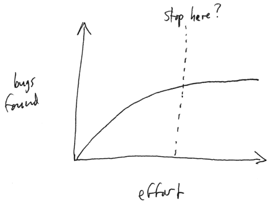

Testing
=======

Testing - execute (part of) the implementation, see if it behaves as expected

Questions:

> Why do we test?
>
> How do we test?
>
> [Ask for suggestions.]

Why: to gain confidence that the code is correct.

> Question: can testing ever give us complete confidence that the code is correct?

How: we typically test at different levels:

> Unit testing: test specific classes and methods, fine grained
>
> Subsystem testing: test an entire "package" at a high level
>
> > For example: say we have a compiler broken into subsystems for tokenizing the input file, parsing the input file, and generating code. Describe how each subsystem might be tested.
>
> System testing: test the system as a whole (possibly by simulating a user of the system)

We will focus on unit testing: making sure that our classes and methods work correctly.

Each class will have a suite of unit tests.

Basic idea in writing a unit test:

> create one or more objects
>
> call a method or methods on those objects
>
> check if the behavior of the called method(s) was correct (typically, by checking the return value(s) using assertions)

A unit testing framework can make writing an running tests easier

> E.g., JUnit for testing Java classes

Test adequacy
-------------

How do we know when we have done "enough" testing? We know that we can never (in general) exhaustively test software. However, we should have some idea of when we have an "adequate" set of tests. This is the problem of test adequacy.

So: what are some metrics we could use to determine when our tests are adequate?

> [ask for suggestions]

One kind of metric for test adequecy is code coverage. There are various levels of code coverage:

> method coverage: ensure that every method is called
>
> statement coverage: ensure that every statement in every method is executed
>
> branch coverage: ensure that every branch (decision point) in the program is exercised in all possible ways. For example, the tests must ensure that every if statement and loop condition is made both true and false by the tests.

Example: How many different conditions need to be tested to completely cover the following "if" statement?

		if ((a || b) && (c || d))
		{
		   // do something
		}
		else if (a || b)
		{
		   // do something else
		}
		else if (c || d)
		{
		   // do something different than above
		}
		else if
		{
		   // do something completely different
		}

A code coverage tool can automatically analyze your tests and the program being tested in order to determine the exact level of code coverage.

As a rule of thumb, your tests should achieve:

> 100% method coverage. If a method is never called, then remove it.
>
> 100% statement coverage (except debugging and error handling code). If a statement can't be executed, remove it.
>
> As close as possible to 100% branch coverage. It is surprisingly difficult to reach 100% branch coverage, but you should try.

We can look at the problem from an economic perspective. (This is appropriate for system-level testing.) We have finite resources (money, time). We have two objectives in testing:

> reach an "acceptable" level of quality
>
> maximize the return on the investment of resources in testing

Although we should always strive for the highest quality, the total absence of defects is not necessary for most applications.

Testing effort will eventually reach a point of diminishing returns:

> 

Once a testing effort reaches the point where the rate at which bugs are being found is sufficiently close to 0, we can stop testing. (Or, at least, more testing is not likely to yield many more bugs.)

**How do you know when a faucet has stopped dripping?**

And, at that point, what type of bugs remain?

**Do you know what happens when you don't take the full course of antibiotics prescribed by your doctor?**
